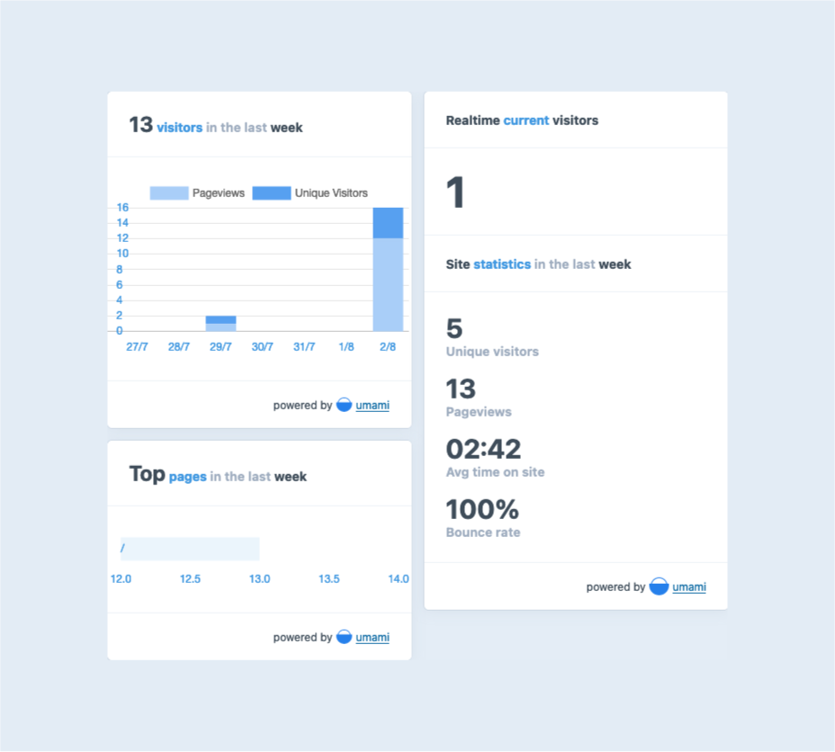

# Umami for Craft CMS

Statistics and chart widgets for Umami.



## Requirements

This plugin requires Craft CMS 3.0.0-beta.23 or later and [Umami](https://umami.is)

## Installation

To install the plugin, follow these instructions.

1. Open your terminal and go to your Craft project:

        cd /path/to/project

2. Then tell Composer to load the plugin:

        composer require stenvdb/craft-umami

3. In the Control Panel, go to Settings → Plugins and click the “Install” button for Umami. 

## Configuring Umami

This plugin obviously requires Umami running on one of your servers. Once it is up and running (which is [super easy](https://umami.is/docs/install)), configure Umami's settings in a `config/umami.php` file (multi-site config is supported). See an example below:

```
<?php

return array(
    '*' => array(
        // The domain name where Umami is hosted. This is also the URL where the tracker code is pointed to.
        'baseUri' => '$UMAMI_BASE_URI',

        // The website ID of this site. You can find the ID in your tracking code snippet.
        'websiteId' => '$UMAMI_WEBSITE_ID',

        // You can also use multi-site config values, e.g.
        // 'websiteId' => [
        //     'default' => '$UMAMI_WEBSITE_ID',
        //     '<...>' => '<...>'
        // ]

        'username' => '$UMAMI_USERNAME',

        'password' => '$UMAMI_PASSWORD',

        // Automatically inject a tracking script in your site
        'injectTracking' => false,
    ),
    'production' => [
        'injectTracking' => true,
    ],
);
```

## Tracking Code Snippet

When enabling `injectTracking` setting, the tracking snippet will automatically be injected into the head section of your site.
This is disabled by default. 

Alternatively you can use the following code snippet to force the code injection in your template:

```

``` 

## Umami Roadmap

* Entry tracking report field (on a per entry basis)
* Have an idea? [Let me know](https://stenvdb.be/contact)
